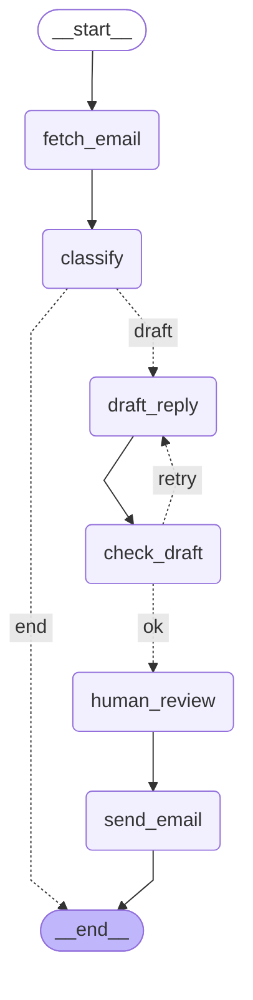

```mermaid
---
config:
  flowchart:
    curve: linear
---
graph TD;
	__start__([<p>__start__</p>]):::first
	fetch_email(fetch_email)
	classify(classify)
	draft_reply(draft_reply)
	check_draft(check_draft)
	human_review(human_review)
	send_email(send_email)
	__end__([<p>__end__</p>]):::last
	__start__ --> fetch_email;
	check_draft -. &nbsp;retry&nbsp; .-> draft_reply;
	check_draft -. &nbsp;ok&nbsp; .-> human_review;
	classify -. &nbsp;end&nbsp; .-> __end__;
	classify -. &nbsp;draft&nbsp; .-> draft_reply;
	draft_reply --> check_draft;
	fetch_email --> classify;
	human_review --> send_email;
	send_email --> __end__;
	classDef default fill:#f2f0ff,line-height:1.2
	classDef first fill-opacity:0
	classDef last fill:#bfb6fc

```
